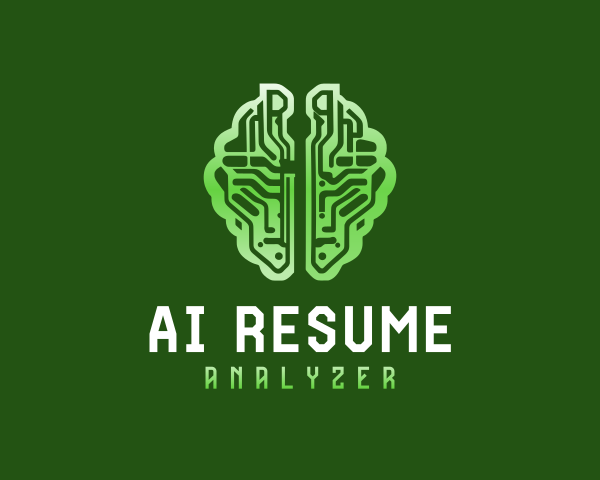

# AI Resume Analyzer

[](https://www.python.org/downloads/)
[](https://flask.palletsprojects.com/)
[](LICENSE)

**AI-powered resume analysis tool that identifies skill gaps, predicts career growth, and provides personalized learning resources.**



---

## ✨ Features

- 📄 **Resume Upload & Analysis** — Upload PDF resumes for instant skill extraction
- 🎯 **Skill Gap Detection** — Identify missing skills for target job roles
- 📊 **TF-IDF Scoring** — Accurate relevance matching between resume and job requirements
- 👤 **User Accounts** — Secure email/password authentication with password reset
- 📈 **Analysis History** — Track all analyses with interactive charts
- 🔍 **Drill-Down Analytics** — Click skill bars to see detailed gap analysis
- 🎨 **Modern UI** — Responsive design with smooth login/signup preview background
- 🚀 **Production-Ready** — Deployed on Railway with PostgreSQL support

---

## 🚀 Quick Start

### Local Development

**1. Clone & Install**
```bash
git clone https://github.com/Om-awasth/AI-Resume-Analyzer.git
cd AI-Resume-Analyzer
python -m venv venv
source venv/bin/activate  # or `venv\Scripts\activate` on Windows
pip install -r requirements.txt
```

**2. Configure Environment**
```bash
cp .env.example .env
# Edit .env with your settings (optional for local dev)
```

**3. Run Locally**
```bash
python app.py
```
Visit: **http://localhost:8080**

---

## 📋 Project Structure

```
AI-Resume-Analyzer/
├── app.py                    # Main Flask application
├── requirements.txt          # Python dependencies
├── Procfile                  # Railway deployment config
├── .env.example              # Environment variables template
│
├── model/
│   ├── users.py             # SQLAlchemy models & auth
│   ├── skills.py            # Job skills database
│   └── tfidf_model.py       # ML scoring engine
│
├── utils/
│   ├── pdf_reader.py        # PDF extraction & parsing
│   └── skill_extractor.py   # NLP skill detection
│
├── templates/
│   ├── index.html           # Main analyzer page
│   ├── login.html           # Login with preview
│   ├── signup.html          # Signup form
│   ├── history.html         # Analysis history
│   └── ...                  # Other pages
│
├── static/
│   ├── style.css            # Main stylesheet
│   ├── script.js            # Frontend logic
│   └── images/
│       └── logo.png         # Logo asset
│
└── data/
    └── app.db               # SQLite database (local)
```

---

## 🔑 Key Features Explained

### Resume Analysis
- Upload any PDF resume
- AI extracts skills using NLP
- Compares against 20+ job roles
- Generates 0-100% match score

### Skill Gap Detection
- Shows matched skills ✅
- Shows missing skills ❌
- Provides learning resources per skill
- Tracks learning progress

### User Dashboard
- View all past analyses
- Interactive TF-IDF charts
- Track skill improvements
- Export analysis data

### Authentication
- Email/password signup & login
- Secure session management
- Password reset via email (dev mode shows token)
- Password hashing with werkzeug

---

## 🌍 Deployment

### Deploy to Railway (Recommended)

See [DEPLOY.md](./DEPLOY.md) for complete instructions.

**Quick Summary:**
1. Create repo on GitHub
2. Go to https://railway.app
3. Connect GitHub repo
4. Add PostgreSQL
5. Deploy ✅

**Your app will be live at:** `your-app-name.railway.app`

### Self-Hosted (DigitalOcean, etc.)

See [DEPLOY.md](./DEPLOY.md) for:
- Gunicorn + Nginx setup
- Systemd service configuration
- SSL/TLS with Let's Encrypt
- Database migration

---

## 🛠️ Tech Stack

**Backend:**
- Flask 3.0 — Web framework
- SQLAlchemy 2.0 — ORM & database
- scikit-learn — TF-IDF ML model
- PyPDF2 — PDF parsing

**Frontend:**
- HTML5 / CSS3 / JavaScript
- Chart.js — Interactive charts
- Responsive design (mobile-friendly)

**Database:**
- SQLite (local development)
- PostgreSQL (production)

**Deployment:**
- Railway (PaaS platform)
- Gunicorn (WSGI server)
- Docker ready (optional)

---

## 📊 Sample Workflow

```
1. User Signs Up
   └─→ Email/password auth
   
2. Uploads Resume (PDF)
   └─→ PDF → Text extraction
   └─→ NLP → Skill detection
   
3. Selects Target Job Role
   └─→ Fetches job requirements
   └─→ Calculates TF-IDF score
   
4. Views Analysis
   └─→ Matched skills (green)
   └─→ Missing skills (red)
   └─→ Learning resources (links)
   
5. Tracks Progress
   └─→ View history chart
   └─→ Compare past analyses
   └─→ Monitor improvement
```

---

## 🔐 Security

- ✅ Password hashing (Werkzeug)
- ✅ SQL injection prevention (SQLAlchemy ORM)
- ✅ CSRF protection (Flask sessions)
- ✅ Secure headers enabled
- ✅ Input validation on all forms
- ✅ File upload restrictions (PDF only, 5MB max)

---

## 📈 Future Enhancements

- [ ] AI resume feedback & suggestions
- [ ] Job description upload & matching
- [ ] Resume template generator
- [ ] Interview preparation questions
- [ ] Salary range predictor
- [ ] CSV/PDF export reports
- [ ] Mobile app
- [ ] Integration with LinkedIn

---

## 🤝 Contributing

Contributions are welcome! Fork → Create branch → Commit → Push → PR

```bash
git checkout -b feature/awesome-feature
git commit -m "Add awesome feature"
git push origin feature/awesome-feature
```

---

## 📝 License

MIT License — See [LICENSE](LICENSE) for details

---

## 👤 Author

**Om Awasthi**
- GitHub: [@Om-awasth](https://github.com/Om-awasth)
- Email: omawasthi@example.com

---

## 💡 Support

- 📖 Check [DEPLOY.md](./DEPLOY.md) for deployment help
- 🐛 Open an issue for bugs
- 💬 Discussions for questions

---

## 🎯 Getting Started Next

1. **Try it locally:** `python app.py`
2. **Deploy to Railway:** Follow [DEPLOY.md](./DEPLOY.md)
3. **Improve features:** Check issues and contribute
4. **Share feedback:** Star ⭐ if you find it useful!

---

**Made with ❤️ using Flask + ML**
